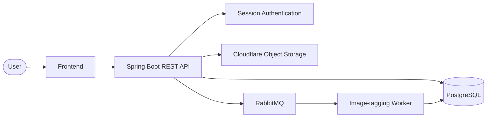

# Hey there! 👋

<div align="center">

[](https://git.io/typing-svg)

<br>


<br><br>


[](https://github.com/shmoonwalker)

</div>

---

## 🌙 A little about me...

Hey! I'm **Shadi** — a Junior Java Backend Developer based in the Netherlands 🇳🇱

I'm currently completing the **HackYourFuture Software Development program**, where my focus has moved from general web development into what I enjoy most: **Java backend development**. ☕️

I like building the things happening behind the scenes — APIs, databases, authentication, application logic, messaging, testing, and all the little pieces that somehow have to work together without exploding. 😃

I learn best by actually building things.

Write it.  
Run it.  
Break it.  
Spend an unreasonable amount of time debugging it.  
Realize the problem was one tiny thing.  
Never forget it again. 😂

Outside coding, I'm still very much a creative person. I love **drawing, knitting, and makeup** 🎨🧶✨

So yes — backend developer, but with glitter.

---

## 💭 What gets me curious

- ☕ **Java & backend development** — where I feel most at home
- 🧠 **Application architecture** — understanding how everything fits together
- 🗄️ **Databases** — designing data that actually makes sense
- 🔐 **Authentication & security** — because "it works" isn't enough
- ⚡ **Messaging & asynchronous systems** — RabbitMQ made things interesting
- 🐳 **Docker & deployment** — getting things out of localhost
- 🤖 **AI & Machine Learning** — something I want to explore more deeply
- 📐 **Mathematics** — especially where it connects with computing and AI
- ✨ **UI/UX** — I may live in the backend, but I still appreciate pretty things

---

## 🛠️ My Tech Stack

### ☕ Backend

<div align="center">


</div>

### 🗄️ Databases & Messaging

<div align="center">


</div>

### 🧪 Testing & APIs

<div align="center">


</div>

### 🐳 Tools, Cloud & Delivery

<div align="center">


</div>

### 🎨 Frontend

<div align="center">


</div>

---

## 🚀 Featured Project

### 🖼️ Image Hosting Service

<div align="center">

[](https://github.com/shmoonwalker/Image-Hosting-Service)
[](https://image-hosting-service-frontend-production.up.railway.app/)

</div>

<div align="center">

[](https://github.com/shmoonwalker/Image-Hosting-Service/actions/workflows/ci.yml)
[](https://github.com/shmoonwalker/Image-Hosting-Service/blob/main/LICENSE)
[](https://github.com/shmoonwalker/Image-Hosting-Service/commits/main)

</div>

A full-stack image hosting application built around a **Java + Spring Boot backend**.

This project gave me the chance to go beyond basic CRUD and work with several parts of a real backend system.

### ✨ What's inside?

- ☕ Java & Spring Boot backend
- 🌐 REST API
- 🐘 PostgreSQL
- 🗃️ Flyway database migrations
- 🔐 Registration, login & session-based authentication
- 🖼️ Image upload and object storage
- ☁️ Cloudflare
- 📨 RabbitMQ for asynchronous image tagging
- 🏷️ JSONB image tags
- 🔎 Image search
- 🔗 Expiring public share links
- 🧪 Unit & integration tests
- 🐳 Docker
- ⚙️ GitHub Actions / CI/CD
- 🚂 Railway deployment
- 📊 Grafana monitoring & logs

### 🧩 How it fits together



<div align="center">

### 🌐 It's not trapped in localhost!

[](https://image-hosting-service-frontend-production.up.railway.app/)

</div>

---

## 💻 More Things I've Built

### 🎟️ Ticket Tracking Backend

A Java/Spring Boot backend for managing **projects, tickets, team members, and assignments**.

`Java` • `Spring Boot` • `Spring JDBC` • `PostgreSQL` • `Docker` • `JUnit` • `Mockito`

Features include project membership and roles, ticket assignment, ticket status management, REST endpoints, database integration, and automated testing.

### 🏫 School Manager

A backend project focused on modelling and managing school-related data.

`Java` • `Spring Boot` • `REST APIs` • `SQL` • `Relational Database Design`

### 🎉 Local Events Platform — In Progress 🚧

Currently building a **local events platform** with my team as part of HackYourFuture.

I'm working mainly on the **backend events domain**, including:

- Event data modelling
- Categories
- Locations & addresses
- Event status
- Search & filtering
- API design
- PostgreSQL database design

Still cooking... 👩‍💻🔥

---

## ☕ Shadi.java

```java
public class Shadi {
    private final String role = "Junior Java Backend Developer";
    private final String[] currentlyUsing = {
        "Java",
        "Spring Boot",
        "PostgreSQL",
        "RabbitMQ",
        "Redis",
        "Docker"
    };

    private int coffees = 0;

    public void startCoding() {
        coffees++;
        while (!testsAreGreen()) {
            debug();
            questionMyLifeChoices();
            tryAgain();
        }
        celebrateForApproximatelyFiveMinutes();
        buildSomethingElse();
    }

    public void learnSomethingNew() {
        build();
        breakThings();
        understandWhy();
        buildAgain();
    }
}
```

<div align="center">

Current status: probably staring at a stack trace 👁️👄👁️

</div>

---

## 🧠 Currently Leveling Up

```text
Java                  █████████████████░░░
Spring Boot           ████████████████░░░░
PostgreSQL            ███████████████░░░░░
Docker                █████████████░░░░░░░
RabbitMQ              ███████████░░░░░░░░░
Redis                 █████████░░░░░░░░░░░
AI / ML               ████░░░░░░░░░░░░░░░░
Dutch                 ██░░░░░░░░░░░░░░░░░░ 😭
```

---

## 📊 GitHub Activity

<div align="center">


</div>

---

## 🌱 From This…

```javascript
const oldShadi = {
  status: "new dev alert! 🚨",
  technologies: ["HTML", "CSS", "JavaScript"],
  backend: "sounds scary",
  plan: "figure it out somehow"
};
```

### …to this ☕🚀

```java
BackendDeveloper shadi = new BackendDeveloper();
shadi.use("Java");
shadi.use("Spring Boot");
shadi.use("PostgreSQL");
shadi.deploy();
shadi.keepLearning();
System.out.println("We got somewhere 😭");
```

Sometimes it’s nice to look back and realize that the things that once looked impossible eventually became normal.

Still a lot to learn. That’s the fun part. 🌙

---

## 💌 Let’s Connect!

<div align="center">

I’m currently building my backend portfolio and working toward my first professional role as a Java Backend Developer. ☕🚀

[](https://github.com/shmoonwalker)
[](https://image-hosting-service-frontend-production.up.railway.app/)

<br><br>


Thanks for stopping by! 🌙✨

<br>

“The best time to plant a tree was 20 years ago. The second best time is now.”

<br>

Apparently that applies to learning Java too. ☕

</div>
